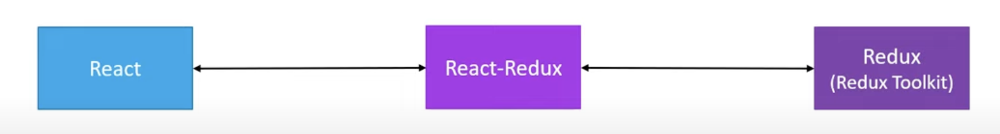
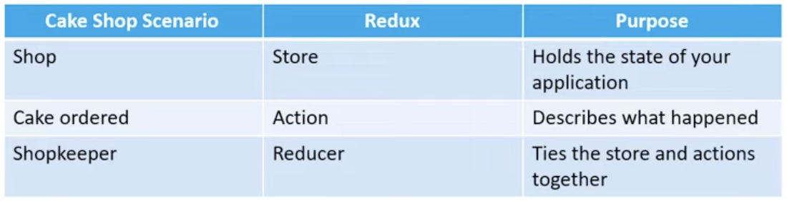
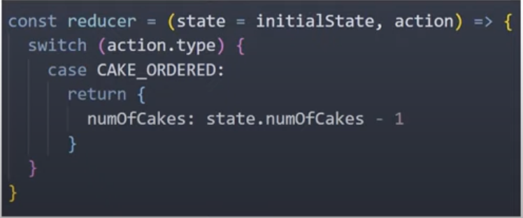

# React Redux Toolkit.


## About this repo.

This repository contains a practical and theorical examples of React with redux and redux toolkit and its explication.

## What is Redux.

**Redux** is a predictable state container for javascript applications

- **It's for javascript applications**
  - Redux is not tied to React.
  - Can be used with React, Angular, Vue or even Vanilla Javascript.
  - Redux is a library for JavaScript applications.

- **It's a state container**
  - Redux store the state of the application.
  - State of an application is the state shared by all the individual components of that application.
  - Redux will store and manage the application state.

- **It's predictable**
  - The changes to your application's state become predictable.

## Why Redux.

if you want to manage the global state of your application in a predictable way, redux can help you.

The patterns and tools provided by Redux make it easier to understand when, where, why and how the state in your application is being updated, and how your application logic will behave when those changes occur.

**Redux** guides you towards writing code that is predictable and testable, which helps give you confidence that your application will work as expected.

## What is Redux Toolkit.

**Redux toolkit** is the official, opinionated, batteries-included toolset for efficient Redux development. It is also intended to be the standard way to write Redux logic in your application.

## Why Redux Toolkit.

- Redux is great, but it does have a few shortcomings
  * Configuring redux in an app seems complicated.
  * In addition to redux, a lot of other packages have to be installed to get redux to do something useful.
  * Redux requires too much boilerplate code.

- Redux toolkit serves as an abstraction over redux. It hides the difficult part ensuring you have a good developer experience.

## React-Redux.

**React-Redux** is the official Redux UI binding library for React.



## Summary.

* **React** is a library used to build user interfaces
* **Redux** is a library for managing state in a predictable way in JavaScript applications
* **Redux-Toolkit** is a library for efficient redix development.
* **React-Redux** is a library that provides bindings to use React and Redux (Toolkit) together in an application.

## Few points before we proceed.

- The most basic mistake you can do is learning redux and react in parallel.
- "When should I use redux in my React application?"
  - You have large amounts of application state that are needed in many places in the app.
  - The app state is updated frequently over time.
  - The logic to update that state may be complex.
  - The app has medium or large-sized codebase, and might be worked on by many people.
- Redux has a learning curve.

## Repository Structure.

1. Learn Redux.
2. Learn Redux-Toolkit.
3. Learn React-Redux.

## Prerequisites.

- React fundamentals.
- React Hooks.

## Three Core Concepts.



- A **store** that holds the state of your application.
- An **action** that describes what happened in the application.
- A **reducer** which handles the action and decides how to update the state.

## Three principles

#### First principle.
  > The global state of your application is stored as an object inside a single store.

  Maintain our application state in a single object which would be managed by the **Redux** store

#### Second principle.
  > The only way to change the state is to dispatch an action, an object that describes what happened

  To update the state of your application, you need to let **Redux** know about that with an action.
  Not allowed to directly update the state object.


#### Third principle.
  > To specify how the state tree is updated based on actions, you write pure reducers.

  Reducer - (previousState, action) => newState

  

## Actions.

The only way your application can interact with the store.
Carry some information from your app to the redux store.
Plain Javascript objects.
Have a `type` property that describes something that happened in the application.
The `type` property is tipically defined as string constants

## Reducers.

Specify how the application state changes in response to actions sent to the store.
Function that accepts state and action as arguments and return the next state of the application.

``` javascript
(previousState, action) => newState
```

## Store

One store for the entire application.
Resposibilities: 
  - Holds application state
  - Allow access to state via `getState()`
  - Allow state to be updated via `dispatch(action)`
  - Registers listeners via `subscribe(listener)`
  - Handles unregistering of listeners via the function returned by `subscribe(listener)``


